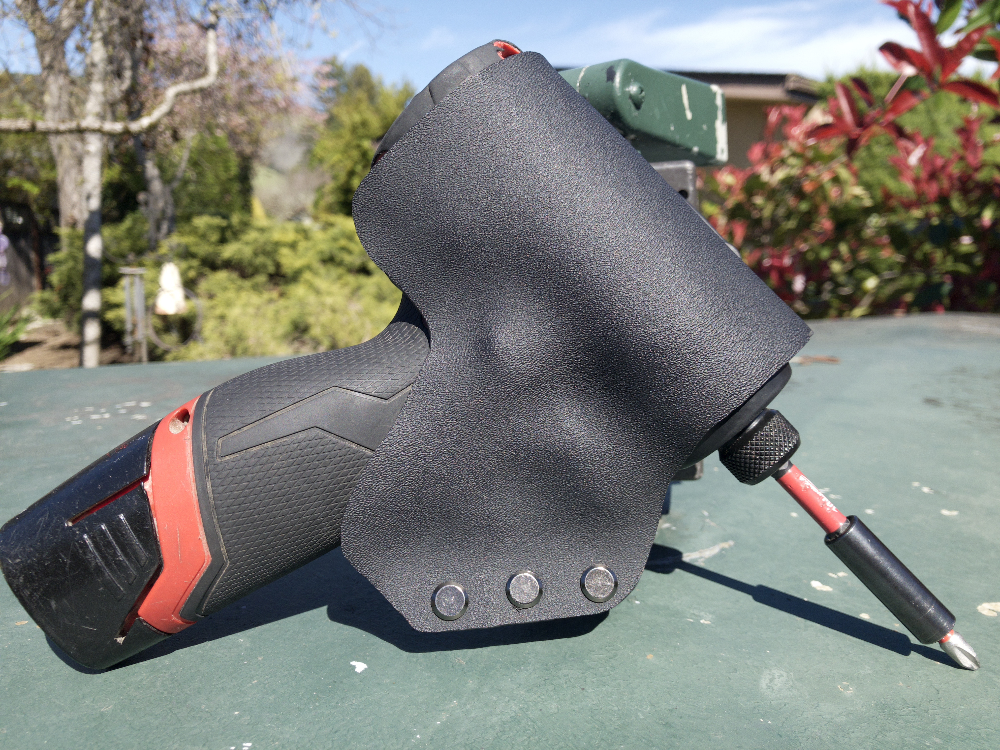

  <kbd>
    
  </kbd>

# Custom fit Kydex Impact Driver Holster

  <kbd>
    
  </kbd>

Holster pictured above was designed and crafted specifically for the Milwaukee M12 2553-20 Impact Driver

## Product Background

ZeroZipMFG is constantly devising new ways to extract more money out of the consumer.

Tools, and tool accessories are just one more avenue of commerce for our company to expand into, so here we are.

There is currently no solid option for the consuming tradesperson to carry small impact drivers/screwguns. All available options are universal, offering sloppy fitment, are relatively bulky, and all require the use of some form of strap to retain the gun.

We knew we had found our new stomping ground.

First, we attempted manufacturing our holsters with very thick veg-tan leather. Very thick was necessary so we could get a snug fit by wet-forming. This was... Not bad. Our product research and development team will revisit and refine this product in the future. 

Along with leather, ZeroZipMFG has easy access to many materials ~~easy access, what in the hell are you talking about~~ one of those being Kydex thermoform plastic.

This is an absolutely excellent material for this application. It (along with other brands of thermoform plastics) has been in use for a long time in firearm holster and blade sheath manufacturing.

With materials at the ready, there was one final step prior to preparing for mass production.

Our research team performed a deep product search across all markets, and of course no one had come up with this.

~~i raced around all the online retailers to obtain all the necessary materials and tools~~ Luckily, ZeroZipMFG - as the massively well funded and equipped multi-national manufacturing conglomerate that it is - was well prepared and ready to undertake this new project.

## Product Release

ZeroZipMFG is proud to announce that production of the above pictured holster is now in full swing ~~oh god no please help me~~ and will soon be available for purchase from our online marketplace ~~online marketplace? what?~~ 

~~you don't need to buy anything, ZeroZipMFG's repositories will always be completely free and under open licensing, so you can make the holster yourself! (though I wouldn't mind a coffee here and there, I sorely need it.) (detailed documentation and instructions for this project coming soon, and more projects in the pipeline)~~

>[!WARNING]
>ZeroZipMFG maintains zero responsibility for loss of limb or life in the event of the inevitable. Make use of this data at your own risk. [Buy our product](https://github.com/ZeroZipMFG)
